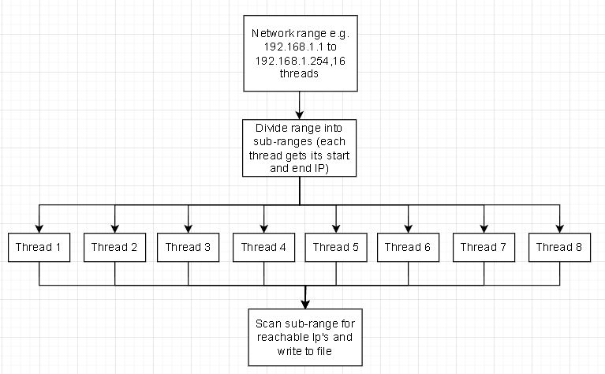

# Network Manager – Extra Information

## Overview
This Network Manager monitors and manages devices on your local network.  
It includes:
- Scheduled background network scanning
- Device discovery and logging
- GUI-focused architecture for management and visualization

---

## Features
- Multi-threaded IP scanning (`192.168.1.1` to `192.168.1.254`) with planned network compatibility
- Detects reachable hosts using ICMP(Internet Control Message Protocol)
- Appends discovered devices to a persistent log file
- Runs as a background service every 20 minutes(planned development)

---

## Architecture
- **Scanner Module**: Divides the network range across threads for fast discovery.
- **Logger**: Appends results safely to `DiscoveredIPs` log.
- **Scheduler**: Triggers scans every 20 minutes.
- **GUI Layer** *(planned)*: Displays discovered devices and network activity in real-time.

---

# Flowcharts
This section shows flowcharts to help explain how the program works.
## Network Device Scanner 
This network manager scans your local subnet for active devices using multi‑threaded ping requests.
Reachable devices are logged for easy monitoring and can be used by the GUI for real‑time updates(in progress).

  

## Known Issues & Vulnerabilities
- **ICMP Ping Limitations** – Some devices may block `isReachable()`, causing false negatives.
- **Hardcoded Subnet** – Currently scans only `192.168.1.x`; customization is planned.
- **Non-synchronized Logging** – Concurrent threads may occasionally write to the log file at the same time.(rare possibility)
