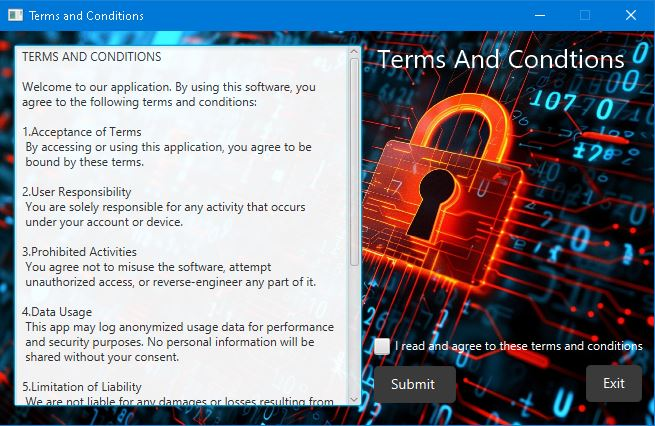
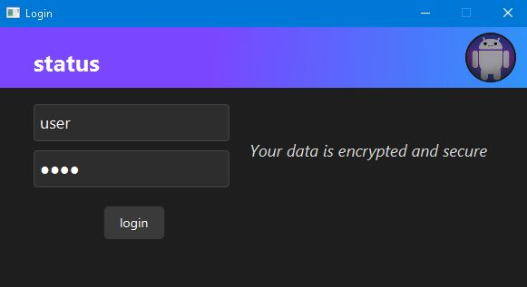
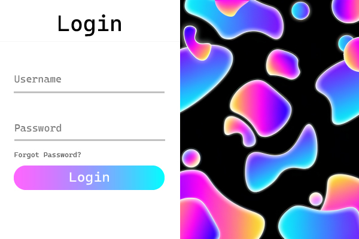

# Ethics & Usage Notice

This project includes Python scripts that perform network scans. **Use these tools only on networks you own or have explicit permission to test. Unauthorized scanning can be illegal and unethical.**  
Please respect privacy and adhere to all applicable laws.

This is a program i have developed using:

- **Python** and **Java** for the core logic
- **CSS** for styling the GUI
- **SQL** for the database management

This allows the app to efficiently manage network operations with a user-friendly interface.

# Project Screenshots

## Current Terms of service page

  

## Current login page

  

## Login page redesign
This is a **in-development redesign** aimed at making the login experience more modern and appealing.  
Suggestions and recommendations are welcome!

  

# Features Completed

- User login with encrypted logging  
- Terms of Service acceptance  
- Basic JavaFX UI  
- User authentication  
- Button functionality 
- Python code examples included for simulation only (not fully integrated)

## In Progress

- Main dashboard interface (under development)  
- advanced scanning features(1/3)  
- Improved UI/UX(dashboard)  
- Full integration of Python scripts planned  
- Performance optimizations

## Additional Documentation

For more details, check the [Detailed Documentation](Additional_Information.md) page.
